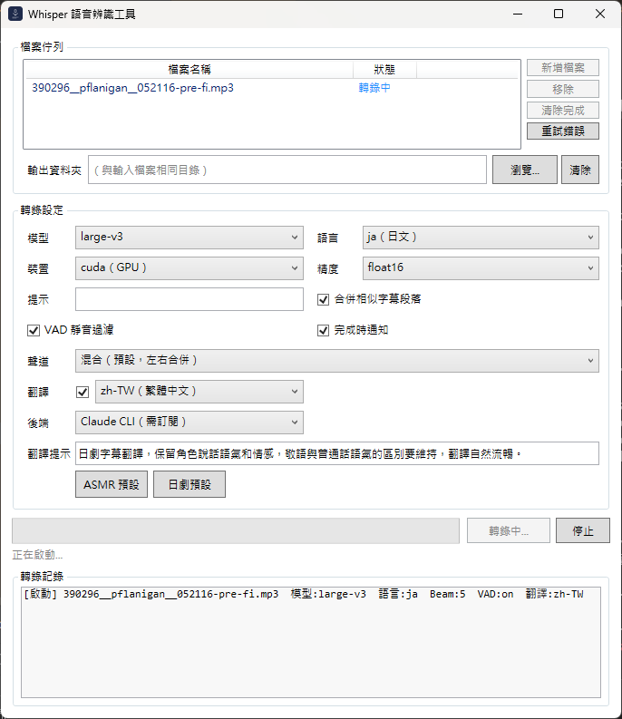
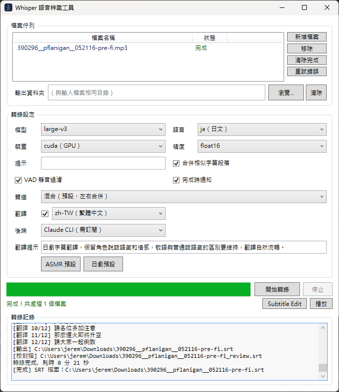

# Whisper Transcriber

[](https://ko-fi.com/paralleluniverse68390)

Transcribe audio/video files into SRT subtitles with optional translation. Powered by [faster-whisper](https://github.com/SYSTRAN/faster-whisper). Available as a WPF GUI (Windows) and CLI.

## Features

- Multiple models: tiny → large-v3, distil-large-v3
- CUDA GPU acceleration (CPU also supported)
- VAD silence filtering to reduce hallucinations
- Semantic subtitle merging via Japanese BERT
- Binaural channel splitting — transcribe left/right channels separately into a single SRT with `[L]`/`[R]` labels
- Translation: googletrans (free), Gemini (free quota, model configurable), Claude Haiku/Sonnet API, Claude CLI
- Outputs both a translated SRT and a side-by-side review SRT (original + translation)
- Batch queue with pipeline mode — translation of file N overlaps with transcription of file N+1

## Screenshots




## Requirements

- Windows 10 / 11
- NVIDIA GPU recommended (CPU works but is ~10× slower)
- Python 3.10+
- .NET 10 Runtime (GUI only)

## Installation

Double-click `setup.bat`. It will automatically:

- Install Python 3.12 via winget (if not present)
- Install .NET 10 Runtime via winget (if not present)
- Create a Python virtual environment and install all dependencies

The first transcription will download the `large-v3` model (~3 GB) from HuggingFace Hub.

## Usage

### GUI

Build the `WhisperGUI/` project with Visual Studio or Rider, or run the compiled `WhisperGUI.exe`.

Drag and drop audio/video files onto the window. Settings are saved to `%AppData%\WhisperGUI\settings.json`.

### CLI

```bash
source venv/Scripts/activate

# Basic transcription (Japanese)
python WhisperTranscriber.py --file input.mp3 --language ja

# Translate to Traditional Chinese (free)
python WhisperTranscriber.py --file input.mp4 --language ja --translate --translate-lang zh-TW

# Translate using Claude API
python WhisperTranscriber.py --file input.mp4 --language ja \
  --translate --translate-backend claude-haiku --claude-api-key sk-ant-...

# Binaural ASMR channel split
python WhisperTranscriber.py --file input.mp4 --language ja --channel split --translate

# CPU mode
python WhisperTranscriber.py --file input.mp3 --device cpu --compute-type int8
```

### CLI Arguments

| Argument | Default | Description |
|---|---|---|
| `--file` | required | Input audio/video file path |
| `--output` | same dir as input | Output SRT path |
| `--model` | `large-v3` | Model size (tiny/base/small/medium/large-v1/v2/v3/distil-large-v3) |
| `--language` | auto-detect | Source language (`ja`, `zh`, `en`, `ko`, …) |
| `--device` | `cuda` | `cuda` or `cpu` |
| `--compute-type` | `float16` | `float16` (GPU) or `int8` (CPU) |
| `--beam-size` | `5` | Beam search width (1–10) |
| `--initial-prompt` | | Hint text fed to Whisper (e.g. `"ASMR audio in Japanese"`) |
| `--merge` | off | Enable semantic subtitle merging (Japanese only) |
| `--vad-filter` | off | Enable VAD silence filtering |
| `--channel` | `mix` | `mix`, `left`, `right`, or `split` |
| `--translate` | off | Enable translation |
| `--translate-lang` | `zh-TW` | Target language |
| `--translate-backend` | `googletrans` | `googletrans`, `claude-cli`, `claude-haiku`, `claude-sonnet`, `gemini-flash` |
| `--claude-api-key` | | Anthropic API Key (required for claude-haiku/sonnet) |
| `--gemini-api-key` | | Google API Key (required for gemini-flash; free quota available at Google AI Studio) |
| `--gemini-model` | `gemini-3.1-flash-lite` | Gemini model ID (can be changed to any available Gemini model) |
| `--translate-prompt` | ASMR style | Style hint appended to the LLM system prompt (LLM backends only) |

## Output Files

| Scenario | Output |
|---|---|
| Transcription only | `<input>.srt` |
| With translation | `<input>.srt` (translated) + `<input>_review.srt` (original + translation) |

## Subtitle Merging (`--merge`)

Uses `sonoisa/sentence-bert-base-ja-mean-tokens-v2` to compute cosine similarity between adjacent segments. Two segments are merged only when **all** conditions hold:

- Cosine similarity ≥ 0.7
- Gap between segments ≤ 1.0 s
- Combined display duration 1.0–6.0 s
- Combined character rate ≤ 15 chars/sec
- Combined character count ≤ 45

## Translation Backends

| Backend | Cost | Notes |
|---|---|---|
| googletrans | Free | No key required; moderate quality |
| Gemini | Free quota | API key from [Google AI Studio](https://aistudio.google.com/); default `gemini-3.1-flash-lite` (500 RPD free); model configurable |
| Claude Haiku API | Paid | API key from [Anthropic Console](https://console.anthropic.com/) |
| Claude Sonnet API | Paid | Best quality |
| Claude CLI | Requires subscription | Needs Claude desktop app installed |

If an LLM backend fails or returns the wrong number of segments, it automatically falls back to googletrans for that batch.

## License

[GNU AGPL v3](LICENSE). Any distribution or network use requires source disclosure.
